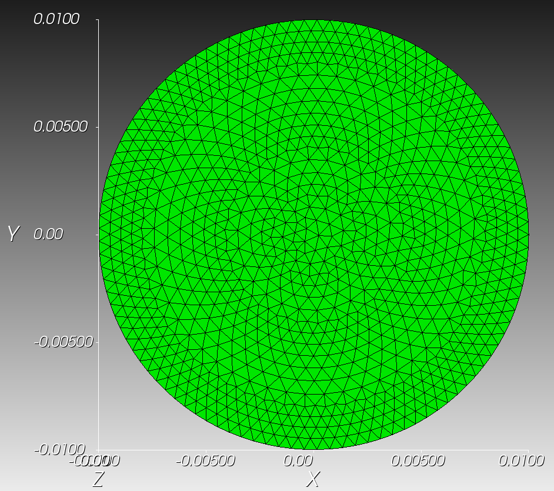
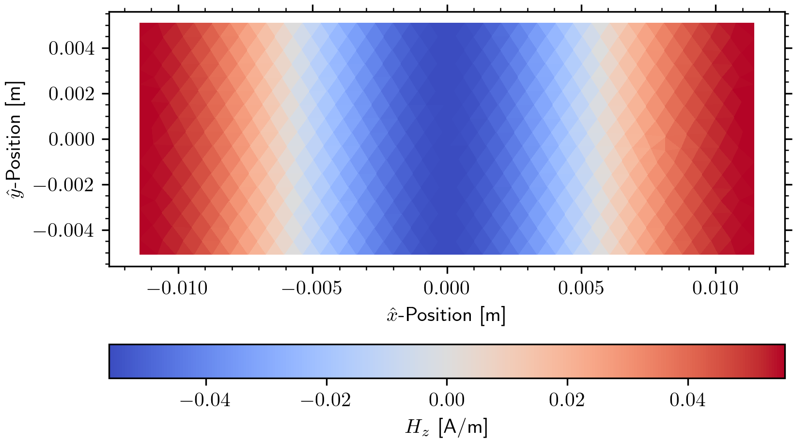
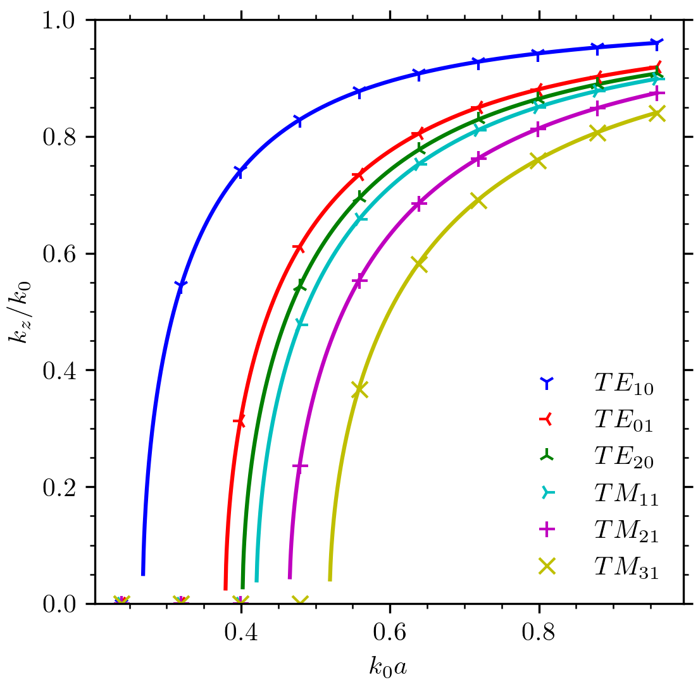
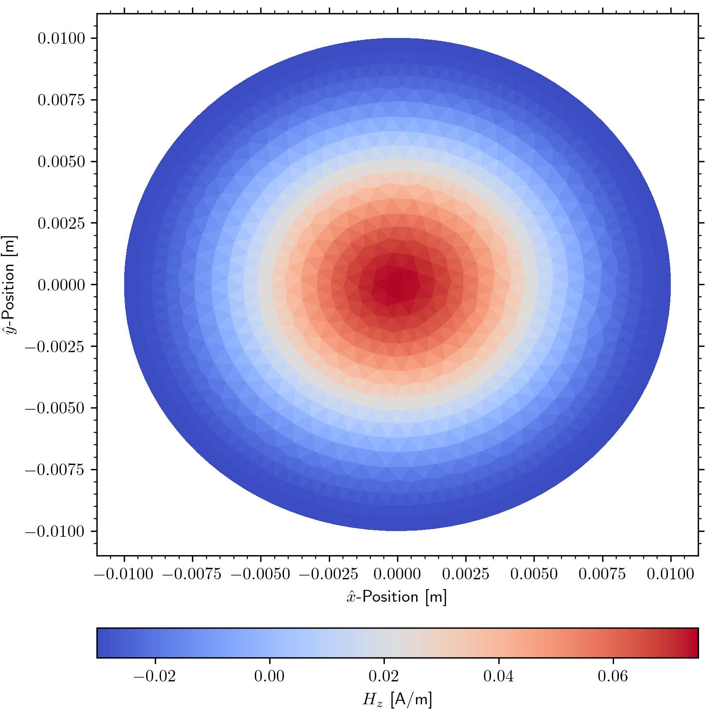
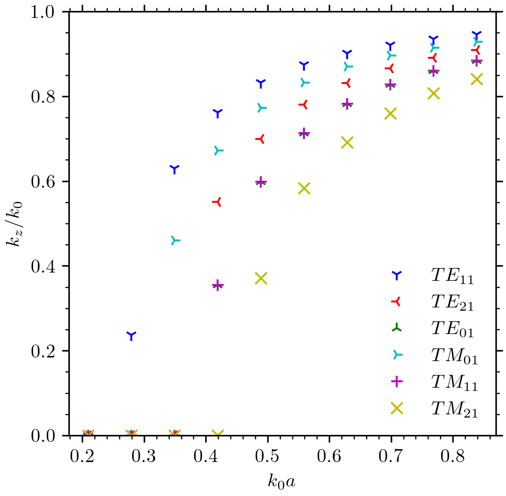
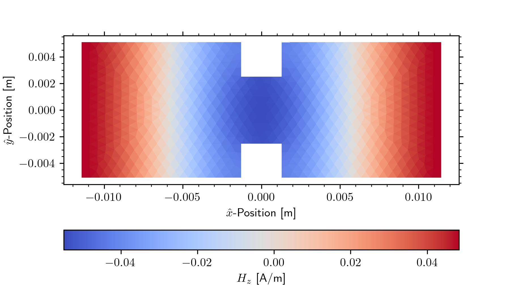
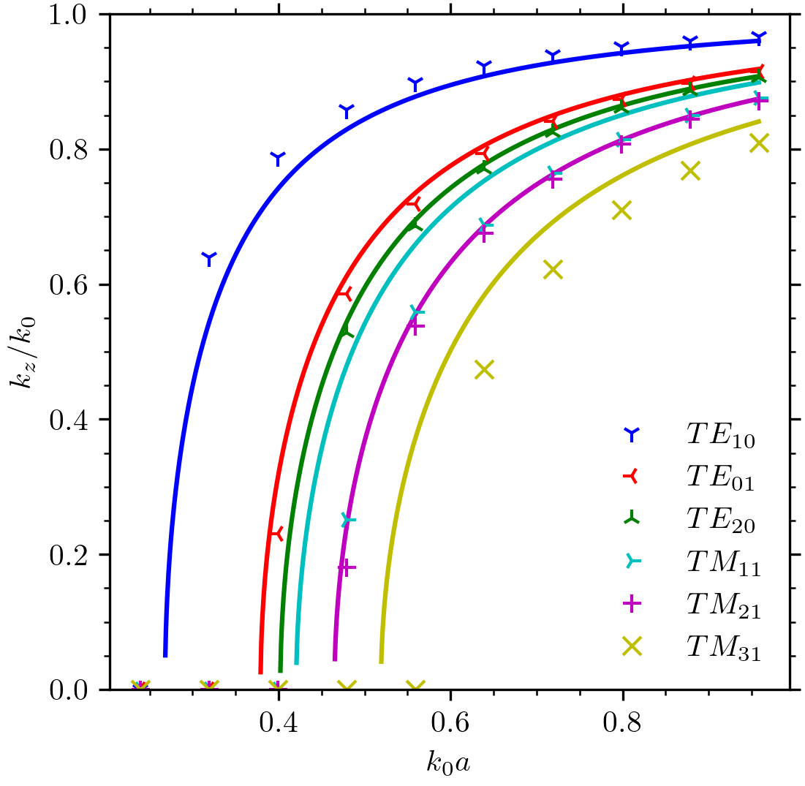

# fem-waveguide

A 2D Finite-Element field profile solver for waveguides of arbitrary cross-sections created ECE 61800 Project 2.
Please reach out if you are interested in the project / course details or the report.

This codebase, as well as others from this class, are not designed to be user-friendly as they were only intended to be
run by myself for the purpose of a class project. With that said however all code is reasonably documented to the
standards outlined in ECE 61800.

## Requirements

If you do not have it installed already, you will first need to [download and install Python](https://www.python.org/).

Next, you will need to install `MeshIO`, `NumPy` and `SciPy` all of which are dependencies for this project.
To install said packages, run the following command in your terminal of choice.

### Windows

    pip install numpy scipy meshio

### Linux/Mac

    pip3 install numpy scipy meshio

## Running

All project configuration occurs in `./src/main.py`.
The model takes an input mesh using the ABAQUS `.inp` format with boundary elements contained in a nodeset.
It is recommended to use Coreform Cubit for the generation of these meshes.
Please see `./rectangle.inp` as an example mesh.
To replace with your own mesh, simply change the path in the `Mesh` constructor within `main.py.

Once configured, the model can be run from the project root with one of the following terminal commands.

### Windows

    python ./src/main.py

### Linux/Mac

    python3 ./src/main.py

## Data

As configured in `main.py`, the model currently finds the first 10 eigenvalues of both the TE and TM modes as well as
their corresponding column indices in the eigenvector array.

Additional plotting / analysis code can be placed below the existing code in `main.py` to view / analyze these field
profiles.
These commands have been removed in this version as they are not critical to the functionality of the model.

## Example Results

Below are several labeled figures from the report.

1. Example Mesh of a Circular Waveguide viewed in Coreform Cubit
   

2. TE01 H-Field Profile in Rectangular Waveguide
   

3. Comparison of Theoretical and Simulated Dispersion Plot for Rectangular Waveguide
   

4. TE01 H-Field Profile in Circular Waveguide
   

5. Modeled Dispersion Plot for Circular Waveguide
   

6. TE01 H-Field Profile in Ridged Rectangular Waveguide
   

7. Comparison of Theoretical Non-Ridged and Simulated Ridged Dispersion Plot for Rectangular Waveguide
   